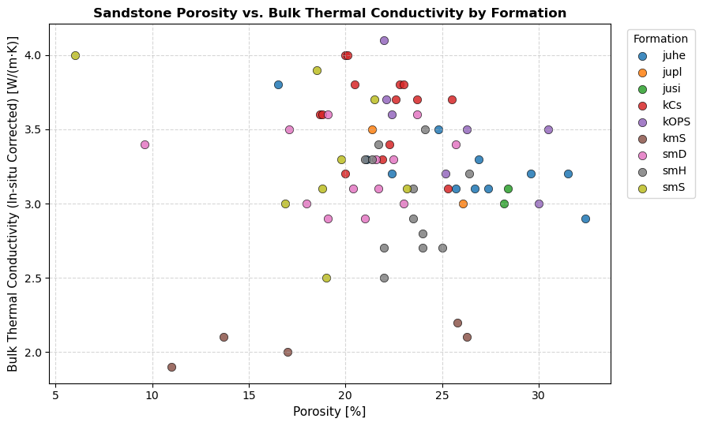
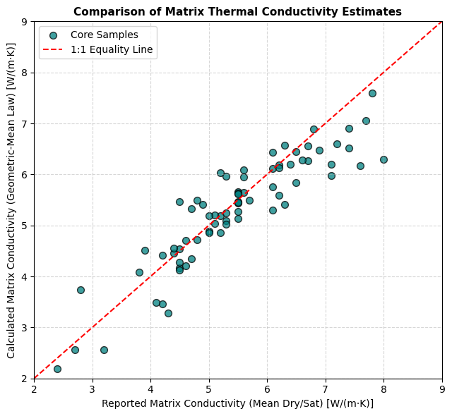
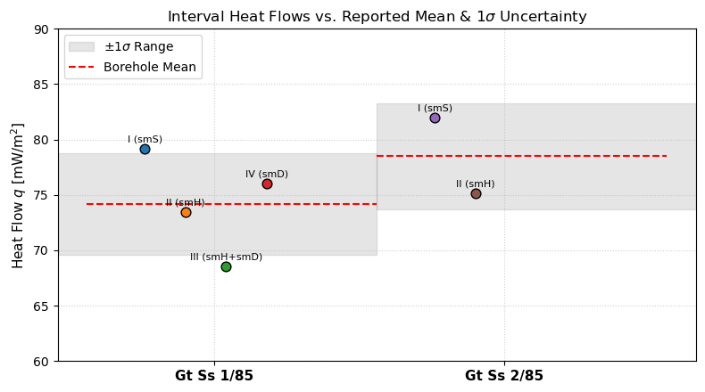
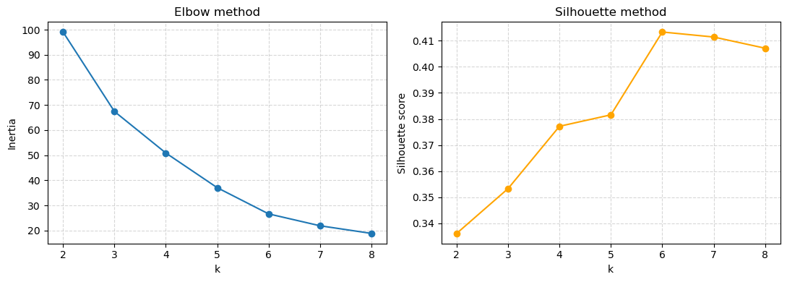
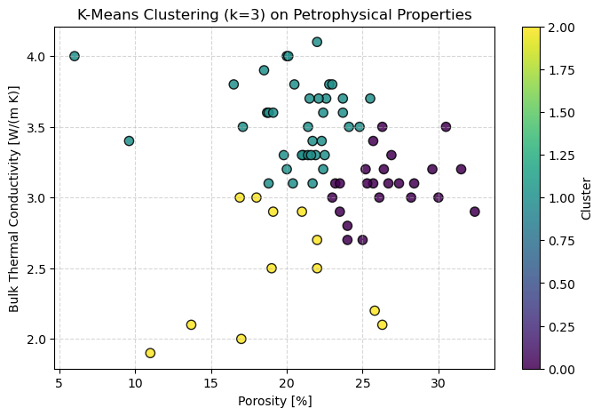

# Abstract {.unnumbered .unlisted}

<!-- Max. 300 words. Write this LAST: study in one or two sentences, what you did,
     the two or three headline numbers, and what they mean. -->


Assessing the geothermal potential of sedimentary basins requires reliable estimates of key petrophysical properties such as porosity, hydraulic conductivity, and thermal conductivity. This study is a re-analysis of the dataset published by @fuchs2010 first reproducing their workflow [(FACT CHECK - if we fully reproduce their workflow why do we get different values???)].{mark}, a geometric-mean matrix-conductivity inversion and Fourier's-law for heat flow, then considering several machine-learning (ML) approaches to test wether they can recover the same petrophysical structure without physical priors. The geometric-mean model reproduces the reported matrix conductivities to within a mean absolute error (MAE) of 0.40 W m^-1^ K^-1^, and the heat flow estimates per interval agree with the published values within 0.23 % error, confirming the robustness of both the method and the data. The ML models tested were: linear regression, decision tree, support vector machine (SVM), K-means clustering, and a neural network. [RESULTS OF THE ML MODELS, WHICH PERFORMED WELL AND WHY, WHICH DIDN'T]{.mark} We conclude that with 74 samples spread over nine formations the petrophysical signal is dominated by inter-formation mineralogical variability [REASONING]{.mark}


<!-- Table of contents, list of figures, list of tables and list of symbols.
     Everything above this line is unnumbered front matter; the page counter
     restarts at 1 (arabic) on the Introduction below. Edit `_symbols.typ` to
     change the symbol list, or drop an argument (e.g. `list_of_tables: false`)
     to omit one of the lists. -->

```{=typst}
#front_matter(symbols: include "_symbols.typ")
```

# Introduction

<!-- 6 %. Background -> knowledge gap -> objectives. Aim for ~600-700 words. -->

## Background

The Northeast German Basin (NEGB) is one of the most intensively explored low-enthalpy geothermal regions in central Europe. The main aquifer targets of this paper are Mesozoic sandstones of the Middle Buntsandstein [@norden2006; @norden2008]. Assessing the viabilty of such a target requires knowing the temperature and depth of the reservoir, which can be retreived based on the heat flow, $q$, and the heat conductivity of the overburden. The heat flow is defined by Fourier's law of heat conduction:

$$
q = -\lambda \frac{\mathrm{d}T}{\mathrm{d}z}.
$$ {#eq-fourier}

where $\lambda$ is the bulk thermal conductivity of the rock and $\mathrm{d}T/\mathrm{d}z$ the vertical temperature gradient. The gradient is measured directly in high-precision borehole temperature logs sampled every 1 cm and averaged over a 1 m moving window. On the other hand $\lambda$ is not measured in-situ. @fuchs2010 first estimate the bulk thermal conductivity of each samle using: 

$$
\lambda = \lambda_s \frac{\Theta_s}{\Theta},
$$

where $\Theta$ is the maximum temperature rise, with the subscript s denoting a reference standard. Then they calculate the matrix thermal conductivity $\lambda_{\text{matrix}}$ using two methods, which we validate in this project. First, a geometric mean model for the bulk conductivity of saturated samples:

$$
\lambda_{\text{satM}} = \lambda_{\text{matrix}}^{1-\phi} \cdot \lambda_{\text{pore}}^{\phi} \rightarrow \lambda_{\text{matrix}}^{1-\phi} = \frac{\lambda_{\text{satM}}}{\lambda_{\text{pore}}^{\phi}}
$$


First they estimate bulk lam of each sample under saturated conditions from eq 2., which we take as our input data, then they calculate the matrix lam w lambda_bulk = (lambda_matrix ^ (1-phi))  ×  (lambda_water ^ phi) -> eq 3, then in another different way: eq 4 using literature values for the lams of each mineral. we test both.


 and is instead obtained from core measurements, corrected to in-situ conditions, or estimated indirectly [@beardsmore2001; @clauser1995].

[TODO: 1–2 paragraphs — why $\lambda$ is the limiting uncertainty in basin-scale heat-flow
assessment; why core coverage is always sparse; why an empirical/statistical predictor
of $\lambda$ from routinely logged properties would be valuable.]

@fuchs2010 addressed this by measuring $\lambda$ and effective porosity on 74
sandstone cores from eight NEGB boreholes with the optical-scanning method
[@popov1999], converting bulk to matrix conductivity with a geometric-mean mixing law
[@woodside1961], and combining the results with temperature logs to derive interval
heat flow. Their dataset is small but unusually complete, which makes it a useful
test bed for the question this report asks.

## Objectives

This report has two linked objectives:

1. **Reproduce the geothermal workflow.** Re-derive matrix thermal conductivities
   from bulk measurements and porosity via the geometric-mean model, and re-compute
   interval heat flow from @eq-fourier, verifying both against the published values.
   This establishes that the data and the implementation are sound before any
   statistical modelling is attempted.
2. **Test whether machine learning adds predictive value.** Apply five standard ML
   models — linear regression, a decision-tree classifier, a support-vector
   classifier, $k$-means clustering and a small neural network — to the same 74
   samples, and assess critically whether they recover known physical relationships
   (the porosity–conductivity trade-off) and known geological structure (the
   stratigraphic formations), or whether they mainly expose the limits of a small,
   heterogeneous dataset.

[TODO: one short paragraph outlining the structure of the remainder of the report.]

# Data

<!-- 3 %. Provenance, size, variables, units, any preprocessing. Keep it to ~350 words. -->

All data are taken from Tables 1, 3 and 4 of @fuchs2010 and were transcribed into the
accompanying notebook; no field or laboratory work was carried out for this report.
Three tables are used:

**Core-sample table (74 rows).** Individual water-saturated sandstone core samples
from eight exploration boreholes in three areas of the basin (Stralsund,
Neubrandenburg, Schwerin), spanning nine stratigraphic formations. Variables:
sample depth (m), bulk thermal conductivity as measured and corrected to in-situ
temperature (W m^-1^ K^-1^), the matrix thermal conductivity reported by the authors,
and effective (Archimedes) porosity (%). Bulk conductivities were measured by optical
scanning [@popov1999].

**Interval heat-flow table (6 rows).** Four homogeneous-gradient intervals in the
Middle Buntsandstein of borehole Gt Ss 1/85 and two in Gt Ss 2/85, each with an
average temperature gradient (°C km^-1^), an average in-situ-corrected $\lambda$, and
the heat flow reported by the authors (mW m^-2^).

**Formation profile table (25 rows).** Depth, formation code and name, measured
temperature gradient and the $\lambda$ that @fuchs2010 derived indirectly for borehole
Gt Ss 1/85 by assuming a constant borehole heat flow.

Formation coverage is strongly unbalanced — several formations are represented by
only two samples (@tbl-formation-stats) — and this imbalance propagates directly into
the classification experiments in @sec-results-ml. No samples were removed and no
imputation was necessary; the only preprocessing applied was conversion of porosity
from percent to fraction for the mixing law, and $z$-score standardisation of features
for the distance- and gradient-based models (@sec-methods-ml).

# Methods

<!-- 12 %. State every model AND its hyper-parameters. The table below is the
     part the rubric explicitly asks for -- keep it complete. -->

## Geothermal calculations

**Optical-scanning measurements.** The bulk conductivities used throughout this report
were not measured here; they are the optical-scanning (OS) values of @fuchs2010, and the
whole analysis inherits that method's characteristics. In OS a focused, continuously
operated heat source and an infrared radiometer are mounted on a common platform and
moved along the sample surface at constant speed and constant separation, so that the
radiometer records the maximum temperature rise $\Theta$ on the heating line trailing
the source (@fig-optical-scanning). For a steady, moving line source this rise is
inversely proportional to conductivity, $\Theta = Q / (2\pi x \lambda)$, with $Q$ the
source power and $x$ the source–sensor distance [@popov1999]. Absolute calibration is
avoided by aligning the sample with reference standards of known $\lambda_\text{R}$ in
the same scan, so that $\lambda = \lambda_\text{R}\,\Theta_\text{R}/\Theta$. The
method is contactless and non-destructive, needs no polished surface, and resolves
$\lambda$ continuously along the core rather than as a single bulk value, which is why
@fuchs2010 could sample nine formations from a limited set of cores. Its quoted accuracy
of about 3 % sets the noise floor of every quantity derived below.

{#fig-optical-scanning width=68%}

**Geometric-mean mixing model.** Bulk conductivity of a saturated porous rock is
modelled as a volume-weighted geometric mean of the mineral matrix and the pore water
[@woodside1961]:

$$
\lambda_{\text{bulk}} = \lambda_{\text{matrix}}^{\,(1-\phi)} \, \lambda_{\text{water}}^{\,\phi},
$$ {#eq-geomean}

with $\phi$ the fractional porosity and $\lambda_{\text{water}} = 0.6$ W m^-1^ K^-1^.
Solving @eq-geomean for the matrix conductivity gives the form implemented in the
notebook,

$$
\log \lambda_{\text{matrix}} = \frac{\log \lambda_{\text{bulk}} - \phi \log \lambda_{\text{water}}}{1-\phi}.
$$ {#eq-geomean-inv}

**Heat flow.** Interval heat flow follows from @eq-fourier as
$q = \lambda \times (\mathrm{d}T/\mathrm{d}z)$. With $\lambda$ in W m^-1^ K^-1^ and the
gradient in °C km^-1^, the result is directly in mW m^-2^, because the
kilometre-to-metre and watt-to-milliwatt conversions cancel.

## Machine-learning models {#sec-methods-ml}

All models are the scikit-learn 1.x implementations [@pedregosa2011], driven from
NumPy/pandas data structures [@harris2020; @mckinney2010]. A single global
`random_state = 42` was used for every stochastic step (splitting, tree induction,
$k$-means initialisation, network weight initialisation) so that all results in this
report are exactly reproducible from the appended notebook. Every supervised model
uses the same 70 / 30 train–test split; the classification split is stratified by
formation. Features entering distance- or gradient-based models (SVC, $k$-means, MLP)
were standardised with `StandardScaler`, fitted on the training partition only and
applied to the test partition, to avoid leakage. Hyper-parameters are listed in
@tbl-hyperparams; where no value is given, the scikit-learn default was kept.

| Model | Features | Target | Estimator and hyper-parameters |
|:--|:--|:--|:--|
| Simple linear regression | porosity | $\lambda_{\text{bulk}}$ | `LinearRegression`; ordinary least squares, no regularisation |
| Multiple linear regression | porosity, depth | $\lambda_{\text{bulk}}$ | `LinearRegression`; as above |
| Decision tree | porosity, $\lambda_{\text{bulk}}$, depth | formation | `DecisionTreeClassifier`; `max_depth=4`, Gini impurity |
| Linear SVM | porosity, $\lambda_{\text{bulk}}$, depth (standardised) | formation | `SVC`; `kernel="linear"`, `C=1.0` |
| RBF SVM | as above | formation | `SVC`; `kernel="rbf"`, `C=1.0`, `gamma="scale"` |
| $k$-means | porosity, $\lambda_{\text{bulk}}$ (standardised) | — (unsupervised) | `KMeans`; $k = 2\ldots8$ scanned, $k=3$ selected, `n_init=10` |
| Neural network | porosity, depth, $\lambda_{\text{bulk}}$ (standardised) | $\lambda_{\text{matrix}}$ | `MLPRegressor`; `hidden_layer_sizes=(16, 8)`, ReLU, Adam, `max_iter=5000` |

: Models applied to the NEGB dataset and the hyper-parameters used. All stochastic steps use `random_state=42`. {#tbl-hyperparams tbl-colwidths="[20,24,14,42]"}

**Model selection and metrics.** Regression performance is reported as the
coefficient of determination $R^2$ and the root-mean-square error (RMSE) on the held-out
test set; classification as test accuracy. The number of clusters $k$ was chosen by
scanning $k = 2 \ldots 8$ and inspecting the inertia (elbow) curve together with the mean
silhouette coefficient [@rousseeuw1987]. No hyper-parameter search (grid search or
cross-validation) was performed, a deliberate restriction discussed in
@sec-disc-models. Method background follows @hastie2009 and @bishop2006; the
individual algorithms are due to @breiman1984 (CART), @cortes1995 (SVM) and
@macqueen1967 ($k$-means).

# Results

<!-- 8 %. Report WHAT you found. Save the interpretation for the Discussion. -->

## Geothermal analysis

Formation-averaged bulk conductivity and porosity are summarised in
@tbl-formation-stats. The Stuttgart Formation (kmS) has both the lowest mean
conductivity (2.06 W m^-1^ K^-1^) and the lowest mean porosity (18.8 %); the Contorta
(kCs) and Postera (kOPS) sandstones are the most conductive (3.62 and
3.51 W m^-1^ K^-1^). These values agree with the formation averages quoted in
Section 4.1 of @fuchs2010.

| Formation | $n$ | $\lambda_{\text{bulk}}$ mean ± sd [W m^-1^ K^-1^] | Porosity mean ± sd [%] |
|:--|--:|--:|--:|
| juhe  | 11 | 3.25 ± 0.24 | 25.9 ± 4.6 |
| jupl  |  2 | 3.25 ± 0.35 | 23.8 ± 3.3 |
| jusi  |  2 | 3.05 ± 0.07 | 28.3 ± 0.1 |
| kCs   | 14 | 3.62 ± 0.28 | 21.8 ± 2.2 |
| kOPS  |  7 | 3.51 ± 0.35 | 25.5 ± 3.6 |
| kmS   |  5 | 2.06 ± 0.11 | 18.8 ± 7.0 |
| smD   | 13 | 3.24 ± 0.25 | 20.2 ± 4.0 |
| smH   | 12 | 3.01 ± 0.33 | 23.2 ± 1.6 |
| smS   |  8 | 3.33 ± 0.51 | 18.0 ± 5.2 |

: Formation-averaged bulk thermal conductivity (corrected to in-situ temperature) and effective porosity. Sample counts are strongly unbalanced. {#tbl-formation-stats}

Pooling all 74 samples, the expected inverse relationship between porosity and bulk
conductivity is not visible (@fig-porosity-lambda): formations overlap heavily in
both variables and the cloud shows no coherent trend.

{#fig-porosity-lambda width=72%}

Matrix conductivities recovered with @eq-geomean-inv reproduce the values reported by
@fuchs2010 with a mean absolute error of 0.40 W m^-1^ K^-1^ over a range of roughly
2.4–8.0 W m^-1^ K^-1^ (@fig-matrix-1to1). The points scatter about the 1:1 line with a
systematic tendency to underestimate, which grows towards higher conductivities.

{#fig-matrix-1to1 width=55%}

Interval heat flows computed from @eq-fourier match the published values to within
0.23 % for all six intervals (@tbl-heatflow). Per-interval values scatter around the
borehole averages of 74.2 ± 4.6 mW m^-2^ (Gt Ss 1/85) and 78.5 ± 4.8 mW m^-2^
(Gt Ss 2/85) reported by the authors: intervals II and IV of Gt Ss 1/85 fall well
within 1$\sigma$, intervals I and III at 1.1–1.2$\sigma$, and both Gt Ss 2/85
intervals within 1$\sigma$ (@fig-heatflow).

| Borehole | Interval | Formation | Gradient [°C km^-1^] | $\lambda$ [W m^-1^ K^-1^] | $q_{\text{computed}}$ | $q_{\text{reported}}$ | Error [%] |
|:--|:--|:--|--:|--:|--:|--:|--:|
| Gt Ss 1/85 | I   | smS     | 23.5 | 3.37 | 79.20 | 79.3 | $-0.13$ |
| Gt Ss 1/85 | II  | smH     | 27.3 | 2.69 | 73.44 | 73.3 | $+0.19$ |
| Gt Ss 1/85 | III | smH+smD | 22.7 | 3.02 | 68.55 | 68.4 | $+0.23$ |
| Gt Ss 1/85 | IV  | smD     | 23.1 | 3.29 | 76.00 | 75.9 | $+0.13$ |
| Gt Ss 2/85 | I   | smS     | 23.3 | 3.52 | 82.02 | 81.9 | $+0.14$ |
| Gt Ss 2/85 | II  | smH     | 23.2 | 3.24 | 75.17 | 75.2 | $-0.04$ |

: Interval heat flow from Fourier's law compared with the values reported by @fuchs2010. Heat flow in mW m^-2^. {#tbl-heatflow}

{#fig-heatflow width=66%}

## Machine-learning analysis {#sec-results-ml}

Results for all five models are collected in @tbl-ml-results.

| Model | Metric | Value |
|:--|:--|--:|
| Linear regression ($\lambda_{\text{bulk}} \sim$ porosity) | slope | $+0.0012$ |
| | test $R^2$ | $-0.006$ |
| | test RMSE | 0.392 W m^-1^ K^-1^ |
| Multiple linear regression ($+$ depth) | test $R^2$ | $-0.091$ |
| | test RMSE | 0.408 W m^-1^ K^-1^ |
| Decision tree (formation) | test accuracy | 0.74 |
| Linear SVC (formation) | test accuracy | 0.52 |
| RBF SVC (formation) | test accuracy | 0.52 |
| MLP regressor ($\lambda_{\text{matrix}}$) | test RMSE | 0.580 W m^-1^ K^-1^ |
| Linear-regression baseline (same features) | test RMSE | 0.604 W m^-1^ K^-1^ |

: Test-set performance of all machine-learning models. {#tbl-ml-results}

**Linear regression.** The simple regression of bulk conductivity on porosity returns
a small *positive* slope ($+0.0012$ W m^-1^ K^-1^ per porosity percent) and a negative
test $R^2$ of $-0.006$, i.e. the fitted line predicts marginally worse than the
training mean. Adding depth as a second predictor degrades the fit further
($R^2 = -0.091$, RMSE 0.408 W m^-1^ K^-1^).

**Decision tree.** The `max_depth=4` tree reaches 74 % accuracy on the 23-sample test
set (@fig-decision-tree). Feature importances are strongly concentrated on depth
(0.912), with a minor contribution from bulk conductivity (0.088) and none at all from
porosity (0.000).

{#fig-decision-tree width=82%}

**Support-vector machine.** After standardisation, the linear and RBF kernels give
identical test accuracy (0.52), well below the decision tree.

**$k$-means clustering.** The inertia curve shows no sharp elbow and the silhouette
score is modest across the whole range (@fig-kmeans-selection); $k = 3$ was selected.
The resulting clusters cut across the nine formations rather than reproducing them
(@tbl-crosstab, @fig-kmeans-clusters): cluster 2 isolates the low-conductivity kmS
samples together with a few smD/smH/smS samples, while clusters 0 and 1 both mix
Jurassic, Keuper and Buntsandstein material.

{#fig-kmeans-selection width=78%}

| Cluster | juhe | jupl | jusi | kCs | kOPS | kmS | smD | smH | smS |
|:--|--:|--:|--:|--:|--:|--:|--:|--:|--:|
| 0 | 7 | 1 | 2 | 1  | 4 | 0 | 2 | 6 | 1 |
| 1 | 4 | 1 | 0 | 13 | 3 | 0 | 8 | 4 | 5 |
| 2 | 0 | 0 | 0 | 0  | 0 | 5 | 3 | 2 | 2 |

: Cross-tabulation of $k$-means clusters ($k=3$, porosity and bulk conductivity only) against true formation. {#tbl-crosstab}

{#fig-kmeans-clusters width=64%}

**Neural network.** The `(16, 8)` MLP predicts matrix conductivity with a test RMSE of
0.580 W m^-1^ K^-1^, marginally better than the 0.604 W m^-1^ K^-1^ of a linear
regression on the same three standardised features — a 4 % improvement on a
23-sample test set.

# Discussion

<!-- 33 %: the heaviest section by far. Be critical, not descriptive. Roughly:
     ~1 page on what the results mean physically, ~1 page on data quality and
     model limitations, ~0.5 page on data preparation and what you would do
     differently. Every claim should tie back to a number in the Results. -->

## Physical consistency of the geothermal workflow

The near-exact agreement of the Fourier's-law heat flows (< 0.23 %, @tbl-heatflow)
is not an independent validation of the physics: it confirms only that the
implementation and the unit handling are correct, because the same $\lambda$ and
gradient values were used as inputs. Its real value is as a control — it rules out
transcription and unit errors in the dataset before the statistical modelling begins.
The residual sub-percent discrepancies are consistent with rounding of the published
inputs to three significant figures.

The scatter of interval values about the borehole means (@fig-heatflow) is more
informative. All six intervals fall within about 1.2$\sigma$ of the respective
borehole average, so the quoted uncertainties of ±4.6 and ±4.8 mW m^-2^ do describe
the interval-to-interval variability well. [TODO: comment on whether that scatter is
better explained by real variation in the thermal field, by lateral facies changes
within the Middle Buntsandstein, or by uncertainty in the interval-average $\lambda$.]

The systematic underestimation of matrix conductivity by the geometric-mean inversion
(@fig-matrix-1to1), growing at high $\lambda$, has a clear physical origin. @eq-geomean
assumes a statistically isotropic, randomly interpenetrating mixture of the solid and
fluid phases and contains no description of pore geometry, connectivity or tortuosity
[@woodside1961; @clauser1995]. In a cemented quartz sandstone, heat is conducted
preferentially through a connected grain-to-grain framework, so the effective
conductivity of the solid skeleton is higher than a random-mixture law implies;
inverting that law therefore assigns too little conductivity to the matrix, and the
bias grows with the matrix–fluid contrast. A second, methodological source of the
offset is that @fuchs2010 define $\lambda_{\text{matrix}}$ as the average of separate
dry and saturated measurements, which is a different estimator, not merely a different
computation of the same quantity — the two numbers are therefore not expected to
coincide exactly.

## Why the machine-learning models underperform {#sec-disc-models}

The negative test $R^2$ of the porosity regression is the single most diagnostic
result in this report. A negative $R^2$ means the fitted line is worse than predicting
the training mean, and the fitted slope even has the wrong sign relative to the
physical expectation: quartz conducts heat at roughly 7.7 W m^-1^ K^-1^ against
0.6 W m^-1^ K^-1^ for pore water, so within a single lithology higher porosity must
lower bulk conductivity. The reason the pooled fit fails is visible directly in
@fig-porosity-lambda and @tbl-formation-stats: the between-formation spread in matrix
mineralogy is comparable to or larger than the within-formation porosity effect, so
pooling nine formations superimposes nine offset trends and destroys the signal. This
is a textbook confounding / Simpson's-paradox situation, and it is the reason a global
linear model is the wrong model class here rather than evidence that the physics is
absent. [TODO: state explicitly what the correct analysis would be — e.g. a
per-formation or mixed-effects regression, or regressing $\lambda_{\text{matrix}}$
rather than $\lambda_{\text{bulk}}$ — and, if you have time, whether the sign flips
when you fit a single formation such as smD or kCs.]

Adding depth makes the multiple regression *worse* on the test set
($R^2: -0.006 \rightarrow -0.091$). With 51 training samples and a predictor that
carries stratigraphic rather than petrophysical information, this is over-fitting in
its simplest form; it is also a reminder that $R^2$ on a single 23-sample split has
very large sampling variance.

The decision tree's 74 % accuracy looks respectable but must be read against its
feature importances: 91 % of the split value comes from depth alone. The tree is
therefore not classifying rock *types* — it is rediscovering the stratigraphic
column, which is ordered in depth by construction. That is a trivially correct but
geologically uninformative solution, and it would not transfer to a different borehole
where the same formations occur at different depths. Its advantage over the SVMs
(0.74 vs. 0.52) is explained by the same mechanism: axis-parallel splits map naturally
onto depth-ordered layer boundaries, whereas an SVM must place oblique hyperplanes in
a space where the petrophysical dimensions carry almost no class information. That the
linear and RBF kernels tie exactly at 0.52 indicates the RBF kernel found no
additional non-linear structure at default `C` and `gamma` — although with no
hyper-parameter search performed, this comparison is weak evidence about the kernels
themselves. [TODO: if you can, re-run the tree with depth removed; the accuracy drop
quantifies how much of the 0.74 is stratigraphy rather than petrophysics, and it is a
strong point to make.]

The $k$-means result completes the picture. Clustering on porosity and conductivity
alone does not recover the nine formations (@tbl-crosstab); the only cluster with a
clean geological identity is cluster 2, which isolates the low-conductivity Stuttgart
Formation — the one formation that is genuinely separated in @fig-porosity-lambda.
This is the expected outcome given that unsupervised clustering can only find
structure that exists in the feature space provided, and confirms from the
unsupervised side what the regression showed from the supervised side: two
petrophysical variables do not determine lithostratigraphy.

The neural network's 4 % RMSE improvement over linear regression (0.580 vs.
0.604 W m^-1^ K^-1^) is not a meaningful margin on a 23-sample test set with a single
split, and no conclusion about model class should be drawn from it. [TODO: state what
would be needed — repeated splits or $k$-fold cross-validation with confidence
intervals — before such a comparison could be trusted.]

## Data quality and dataset limitations

*Sample size and class balance.* 74 samples across nine formations leaves an average
of eight samples per class, and the 30 % test partition contains only 23 samples in
total. A single misclassification therefore shifts accuracy by 4.3 percentage points,
so the difference between 0.74 and 0.52 corresponds to roughly five samples. Reported
accuracies should be read with that granularity in mind, and formations such as jupl
and jusi ($n = 2$) cannot be assessed at all.

*Spatial and stratigraphic coverage.* All samples come from eight boreholes in three
areas, so samples within a borehole are not independent — the effective sample size is
smaller than 74. A random train–test split therefore leaks borehole-specific
information across the split; a grouped (leave-one-borehole-out) split would give a
more honest estimate of how the models generalise. [TODO: this is a strong, concrete
methodological criticism — expand it, and say what you would expect the accuracies to
do under a grouped split.]

*Measurement uncertainty.* Optical-scanning conductivities carry roughly 3 % error
[@popov1999], and the in-situ temperature correction, effective-porosity determination
and interval-gradient averaging each add further uncertainty that is not propagated
anywhere in this analysis. [TODO: comment on whether the 0.40 W m^-1^ K^-1^ MAE of the
geometric-mean inversion is large or small compared with these measurement errors —
this decides whether the model bias you identified above is even resolvable.]

*Transcription.* The tables were re-typed from the publication rather than obtained as
digital data, so transcription error cannot be fully excluded; the sub-percent
heat-flow reproduction above is the main safeguard against it.

## Data preparation and methodological choices

Several preparation choices materially affected the outcome and would be worth
revisiting:

- **Pooling across formations.** Analysing all 74 samples as one population is what
  destroyed the porosity–conductivity signal. Stratifying by formation, or adding
  formation as a categorical predictor, is the single change most likely to improve
  every supervised result.
- **Feature scaling.** Standardisation was essential for the SVMs and $k$-means:
  unscaled, depth (hundreds to thousands of metres) dominates every Euclidean distance
  and the petrophysical variables become invisible. The tree is scale-invariant and was
  correctly left unscaled.
- **Choice of target.** Regressing $\lambda_{\text{bulk}}$ mixes the matrix and fluid
  contributions; $\lambda_{\text{matrix}}$ is the more physically meaningful target
  because the porosity effect has already been removed from it.
- **No cross-validation or hyper-parameter search.** All results rest on one 70/30
  split with `random_state=42`. Repeated $k$-fold cross-validation would replace every
  point estimate in @tbl-ml-results with a mean and a spread, which at this sample size
  is arguably a prerequisite for interpreting them at all.
- **Leakage control.** Scalers were fitted on training data only, which is correct;
  the residual leakage risk in this study is the borehole grouping noted above rather
  than the scaling.

## Outlook

[TODO: 1 short paragraph. What would make ML genuinely useful here — the basin-wide
database @fuchs2010 propose as future work, wireline logs (gamma ray, sonic, density,
neutron porosity) as additional features so that mineralogy is represented, physically
informed features (quartz content, cementation index), and per-formation or
hierarchical models. Close on which of the two workflows you would actually deploy for
a geothermal prospect today, and why.]

# Conclusions

<!-- Optional but recommended: 4-6 short bullets, each tied to a number. -->

1. The geometric-mean inversion reproduces the published matrix conductivities to
   within 0.40 W m^-1^ K^-1^ MAE, with a physically explicable low bias that grows
   with the matrix–fluid contrast.
2. Fourier's-law interval heat flows reproduce the published values to better than
   0.23 %, confirming the dataset and implementation.
3. On the pooled dataset no machine-learning model recovers the expected
   porosity–conductivity relationship; the simple regression returns a negative test
   $R^2$ and a slope of the wrong sign.
4. The decision tree's 74 % accuracy is achieved almost entirely from depth
   (importance 0.91) and therefore recovers stratigraphy, not petrophysics.
5. [TODO: closing statement on what the study says about applying ML to small,
   heterogeneous geothermal datasets.]

# Appendix {.unnumbered}

The annotated Jupyter notebook `<Lastname1>_<Lastname2>_ML_2026.ipynb` is submitted
digitally alongside this report. It contains the full dataset, all calculations and
all figures reproduced here, and is executable end to end with
`random_state = 42`.
